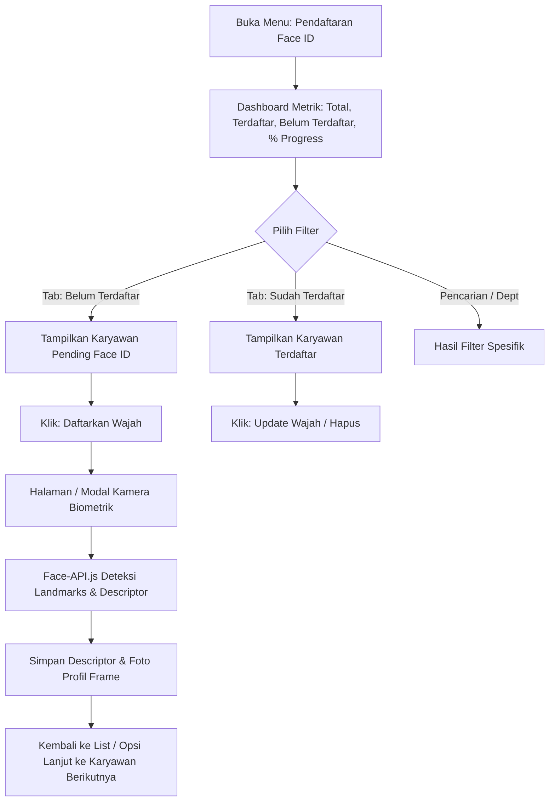

# 📄 Product Requirements Document (PRD)
## Modul: Face ID Enrollment Center (Pendaftaran Biometrik Wajah Terpusat)

---

### 1. 🎯 Problem & Business Goal
* **Latar Belakang & Masalah:**
  * Sebelumnya, tombol pendaftaran dan pembaruan Face ID karyawan (*Register Face / Update Face*) tertanam di dalam kartu *Employee Directory*.
  * Halaman *Employee Directory* memuat informasi sensitif (Gaji Pokok, Status Kontrak, BPJS) dan informasi non-biometrik lainnya.
  * Tim HR kesulitan memantau progress pendaftaran wajah seluruh karyawan pabrik & kantor (tidak ada data ringkas siapa yang belum punya Face ID dan siapa yang sudah).
  * Proses pendaftaran massal menjadi lambat karena HR harus mencari karyawan satu per satu di kartu profil.
* **Tujuan Bisnis:**
  * Menyediakan satu antarmuka terpusat (**Face ID Enrollment Center**) khusus biometrik wajah.
  * Memberikan visibilitas 100% terhadap status kelengkapan data biometrik untuk mendukung keandalan mesin Absensi Kiosk 32".
  * Mempercepat proses pendaftaran beruntun (*batch enrollment*) oleh staf HR.

---

### 2. 👥 User Roles & Permissions (RBAC)
* **Super Admin & HR Manager / Officer:**
  * Akses penuh melihat direktori biometrik wajah (`hr_payroll.employee_directory.view` atau `hr_payroll.attendance.view`).
  * Mendaftarkan wajah baru (*Capture & Store Descriptor*).
  * Memperbarui (*Re-capture / Update Face*).
  * Menghapus (*Reset Face Descriptor*).
  * Ekspor daftar karyawan yang belum terdaftar ke Excel untuk pemanggilan lapangan.
* **General Employee / Viewer:**
  * Tidak dapat mengakses menu ini (proteksi via middleware dan permission check).

---

### 3. 🔄 User Flow & State Machine

---

### 4. 📋 Functional Requirements & Specifications

#### A. Header Metrics Bar (KPI Biometrik):
1. **Total Karyawan Aktif**: Jumlah seluruh karyawan aktif di sistem.
2. **Sudah Terdaftar**: Jumlah & persentase karyawan dengan `face_descriptor` valid (Badge Hijau).
3. **Belum Terdaftar**: Jumlah karyawan tanpa `face_descriptor` yang membutuhkan pendaftaran (Badge Amber/Merah).
4. **Progress Bar Visual**: Indikator persentase kesiapan absensi biometrik secara keseluruhan.

#### B. Quick Filters & Data Ergonomics:
1. **Status Tabs**:
   - `Semua Karyawan` (Total count)
   - `Belum Terdaftar` (Pending count - Default fokus HR saat batch enrollment)
   - `Sudah Terdaftar` (Completed count)
2. **Department Filter**: Dropdown seluruh departemen (PPIC, Production, Office, Maintenance, dsb).
3. **Instant Search**: Pencarian real-time (Nama Karyawan, NIK) dengan debouncing 300ms.
4. **Pagination / Infinite Density**: Pagination bersih (15 atau 20 baris per halaman) dengan informasi "Menampilkan X dari Y data".

#### C. Data Grid / Table Linear Archetype:
* Kolom:
  1. **Karyawan**: Avatar foto, Nama Lengkap, dan NIK.
  2. **Departemen & Jabatan**: Nama divisi dan posisi kerja.
  3. **Status Face ID**:
     - ✅ *Terdaftar* (dengan badge hijau dan tanggal update terakhir).
     - ⚠️ *Belum Terdaftar* (badge kuning dengan label "Belum Ada Data Wajah").
  4. **Aksi**:
     - Tombol Primer: `[Daftarkan Wajah]` (jika belum ada) / `[Perbarui Wajah]` (jika sudah ada).
     - Tombol Sekunder: `[Hapus Wajah]` (dengan dialog konfirmasi pop-up).

#### D. Enrollment Experience (Capture Flow):
* Menggunakan kamera web / HD camera dengan deteksi `face-api.js` (TinyFaceDetector + FaceLandmarks68 + FaceRecognitionNet).
* Real-time visual feedback:
  - Kotak panduan hijau saat wajah terdeteksi dengan tepat di tengah.
  - Peringatan jika wajah miring atau tidak terdeteksi.
* Tombol "Ambil Wajah & Simpan" langsung mengekstraksi float32 descriptor (128 dimensi) dan crop frame foto untuk avatar profil.
* Setelah sukses, sistem mengembalikan pengguna kembali ke **Face ID Enrollment Center** (bukan ke Employee Directory umum) dengan toast notifikasi sukses.

---

### 5. 🛡️ Security, Data Integrity & Enterprise Standard
1. **RBAC Protection**: Endpoint dijamin dengan auth middleware dan role authorization.
2. **Descriptor Security**: Vektor biometrik disimpan dalam bentuk JSON string float32 array, bukan mentahan foto sensitif yang tidak terenkripsi.
3. **Audit Log Ready**: Setiap pendaftaran atau penghapusan biometrik mencatat timestamp dan user penanggung jawab.
